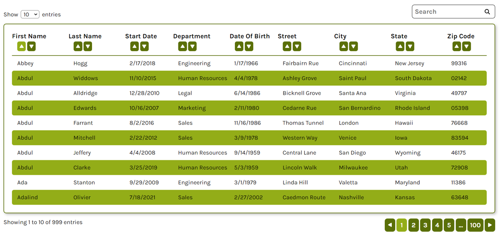

# React Data Table Component
This component is an npm package and can be imported as follows: `npm i @kgabard/react-data-table`

## 1. Description

The React Data Table component takes as input an array of objects with the same properties (the data) and displays them in the form of a table where columns represent the properties and rows represent each object in the array.

## 2. Parameters

### 2.1 data: DataType[]

The data is an array of objects that constitutes the input data. The DataType is an object whose properties are all of string type.

### 2.2 columnsWidth: number[]

The columnsWidth is an array of numbers that represent the flex-grow parameter of each column, indicating the relative width per column.

### 2.3 enableNumberOfEntries?: boolean

The enableNumberOfEntries parameter is optional and controls the display of the dropdown menu allowing selection of the number of entries per page in the table.

### 2.4 enableSearch?: boolean

The enableSearch parameter is optional and controls the display of the search bar for filtering the table.

### 2.5 enableSort?: boolean

The enableSort parameter is optional and controls the display of sorting buttons to sort a column in ascending or descending order.

### 2.6 colors?: { primary: string, secondary: string }

The colors parameter is optional and allows the selection of a primary and secondary color to customize the table.

## 3. Example of use

Given the following data array:

```js
const employeesList = [
  {
    firstName: 'Elijah',
    lastName: 'Larsen',
    startDate: '9/3/2006',
    department: 'Marketing',
    dateOfBirth: '12/26/1997',
    street: 'Chambers Alley',
    city: 'Bridgeport',
    state: 'Tennessee',
    zipCode: '53584',
  },
  {
    firstName: 'John',
    lastName: 'Donovan',
    startDate: '9/1/2006',
    department: 'Sales',
    dateOfBirth: '7/17/1976',
    street: 'Monroe Tunnel',
    city: 'San Antonio',
    state: 'Florida',
    zipCode: '10494',
  },
  ...
]
```

We can then use the component as follows:

```jsx
import Table from '@kgabard/react-data-table'

<Table
  data={employeesList}
  columnsWidth={[1, 1, 0.85, 1, 0.85, 1, 1, 1, 0.7]}
  colors={{ primary: 'var(--highlight-primary)', secondary: 'var(--highlight-secondary)' }}
  enableNumberOfEntries={true}
  enableSearch={true}
  enableSort={true}
/>
```

This will display:
